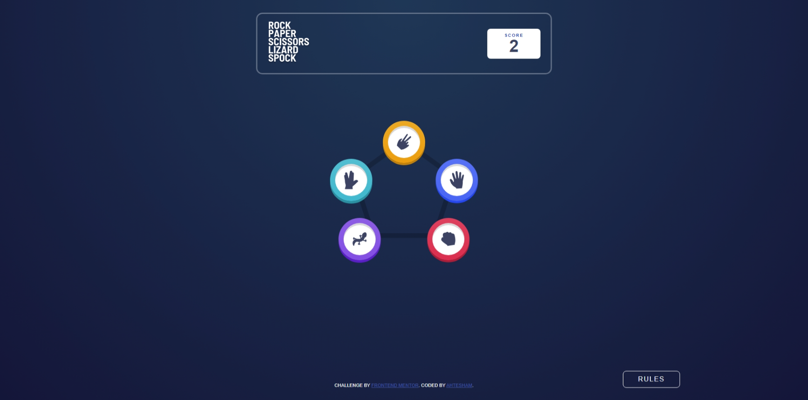

# Frontend Mentor - Rock Paper Scissors solution

This is a solution to the [Rock Paper Scissors challenge on Frontend Mentor](https://www.frontendmentor.io/challenges/rock-paper-scissors-game-pTgwgvgH). Frontend Mentor challenges help you improve your coding skills by building realistic projects. 

## Table of contents

- [Screenshot](#screenshot)
- [Links](#links)
- [Built with](#built-with)
- [Author](#author)

## Screenshot

<!-- (Make sure to add a screenshot.jpeg to your RPC folder or update this path) -->

## Links

- Solution URL: [Github Repo](https://github.com/ahtesham-clcbws/rock-paper-scissor-challange)
- Live Site URL: [GitHub Pages](https://ahtesham-clcbws.github.io/rock-paper-scissor-challange)

## Built with

- HTML5 markup
- CSS Custom Properties
- Flexbox & CSS Grid
- Mobile-first workflow
- Vanilla JavaScript

## Author

- Website - [Broadway Web Services](https://www.clcbws.com)
- Frontend Mentor - [@ahtesham-clcbws](https://www.frontendmentor.io/profile/ahtesham-clcbws)
